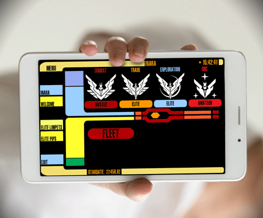

E:D RPi Companion
============
The **E:D RPi Companion** is yet another tool for Elite Dangerous.
This time, it's an information provider, no collecting data and sending to services.
It's main scope is to provide **YOU** with the information you need ingame, like
"Where is the nearest conflict zone?" or "Where can I do that grind?" etc.

With the help of services like INARA.CZ it gives you quick and handy informations.

Originally made for the use of a Raspberry + Toucscreen, it's also available to android devices
 

### Enjoying this?
Just star the repo or make a donation.

Your help is valuable since this is a hobby project for all of us: we do development during out-of-office hours.

### Setup
* Currently not made for public, so there's no setup

### Contribution
Pull requests are very welcome.

### Copyrights
E:D RPi Companion was initially written by **Markus Karl Wackermann**.
